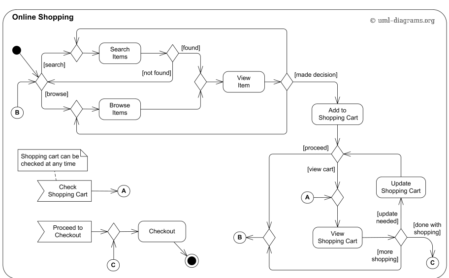

# Online Shopping Platform - Test Cases

Tyto test cases pro různé uživatelské scénáře pro platformu online nakupování založené na diagramu. Každý testovací případ popisuje kroky potřebné k ověření funkčnosti platformy.

## Test Cases

### Test Case 1: Check that user is able to search for a product, add item to cart and checkout successfully

**Kroky:**
1. Uživatel klikne na tlačítko pro otevření vyhledávacího pole.
2. Zkontroluje, zda se URL změnila a obsahuje '/searchInputpage'.
3. Zadá do vyhledávacího pole "iPhone".
4. Klikne na tlačítko pro odeslání vyhledávání.
5. Ověří, že POST požadavek vrátí produkty na stránce s výsledky vyhledávání.
6. Klikne na první produkt s názvem "iPhone".
7. Ověří, že se URL změnila a obsahuje '/item'.
8. Klikne na tlačítko pro přidání do košíku.
9. Klikne na tlačítko pro zobrazení košíku.
10. Ověří, že první položka v košíku má název "iPhone".
11. Klikne na tlačítko pro pokračování k pokladně.
12. Klikne na tlačítko pro dokončení objednávky.
13. Ověří, že se URL změnila a obsahuje '/orderconfirmation'.

**Očekávaný výsledek:**
- Produkt je úspěšně přidán do košíku a objednávka je úspěšně dokončena.

### Test Case 2: Check that user to browse products, add item to cart, update the cart, and checkout

**Kroky:**
1. Uživatel klikne na tlačítko pro procházení produktů.
2. Vybere kategorii "Mobilní telefony".
3. Klikne na první produkt s názvem "iPhone".
4. Ověří, že se URL změnila a obsahuje '/item'.
5. Klikne na tlačítko pro přidání do košíku.
6. Klikne na tlačítko pro zobrazení košíku.
7. Ověří, že první položka v košíku má název "iPhone".
8. Zvýší množství produktů na 2.
9. Ověří, že množství bylo správně aktualizováno na 2.
10. Klikne na tlačítko pro pokračování k pokladně.
11. Klikne na tlačítko pro dokončení objednávky.
12. Ověří, že se URL změnila a obsahuje '/orderconfirmation'.

**Očekávaný výsledek:**
- Produkt je úspěšně přidán do košíku, košík je správně aktualizován a objednávka je úspěšně dokončena.

### Test Case 3: Check that user is able to search for a product, add item to cart and continue with more shopping

**Kroky:**
1. Uživatel klikne na tlačítko pro otevření vyhledávacího pole.
2. Zkontroluje, zda se URL změnila a obsahuje '/searchInputpage'.
3. Zadá do vyhledávacího pole "iPhone".
4. Klikne na tlačítko pro odeslání vyhledávání.
5. Ověří, že POST požadavek vrátí produkty na stránce s výsledky vyhledávání.
6. Klikne na první produkt s názvem "iPhone".
7. Ověří, že se URL změnila a obsahuje '/item'.
8. Klikne na tlačítko pro přidání do košíku.
9. Klikne na tlačítko pro zobrazení košíku.
10. Ověří, že první položka v košíku má název "iPhone".
11. Klikne na tlačítko pro pokračování v nakupování.
12. Ověří, že se URL změnila a obsahuje '/homepage'.

**Očekávaný výsledek:**
- Produkt je úspěšně přidán do košíku a uživatel může pokračovat v nakupování.

### Test Case 4: Check that user is able to check shopping cart anytime and continue shopping

**Kroky:**
1. Uživatel klikne na tlačítko pro zobrazení košíku.
2. Ověří, že se URL změnila a obsahuje '/cart'.
3. Klikne na tlačítko pro pokračování v nakupování.
4. Ověří, že se URL změnila a obsahuje '/homepage'.

**Očekávaný výsledek:**
- Uživatel může kdykoli zkontrolovat košík a pokračovat v nakupování.

### Test Case 5: Check that user is able to search item, view item and made decision return back to SERP

**Kroky:**
1. Uživatel klikne na tlačítko pro otevření vyhledávacího pole.
2. Zkontroluje, zda se URL změnila a obsahuje '/searchInputpage'.
3. Zadá do vyhledávacího pole "iPhone".
4. Klikne na tlačítko pro odeslání vyhledávání.
5. Ověří, že POST požadavek vrátí produkty na stránce s výsledky vyhledávání.
6. Klikne na první produkt s názvem "iPhone".
7. Ověří, že se URL změnila a obsahuje '/item'.
8. Klikne na tlačítko pro návrat na stránku s výsledky vyhledávání.
9. Ověří, že se URL změnila a obsahuje '/search'.

**Očekávaný výsledek:**
- Uživatel se může vrátit na stránku s výsledky vyhledávání.

### Test Case 6: Check that user is able to browse item, view item and made decision return back to SERP

**Kroky:**
1. Uživatel klikne na tlačítko pro procházení produktů.
2. Vybere kategorii "Mobilní telefony".
3. Klikne na první produkt s názvem "iPhone".
4. Ověří, že se URL změnila a obsahuje '/item'.
5. Klikne na tlačítko pro návrat na stránku s výsledky vyhledávání.
6. Ověří, že se URL změnila a obsahuje '/search'.

**Očekávaný výsledek:**
- Uživatel se může vrátit na stránku s výsledky vyhledávání.

### Test Case 7: Check that user is able to search item and return to homepage

**Kroky:**
1. Uživatel klikne na tlačítko pro otevření vyhledávacího pole.
2. Zkontroluje, zda se URL změnila a obsahuje '/searchInputpage'.
3. Zadá do vyhledávacího pole "iPhone".
4. Klikne na tlačítko pro odeslání vyhledávání.
5. Ověří, že POST požadavek vrátí produkty na stránce s výsledky vyhledávání.
6. Klikne na tlačítko pro návrat na domovskou stránku.
7. Ověří, že se URL změnila a obsahuje '/homepage'.

**Očekávaný výsledek:**
- Uživatel se může vrátit na domovskou stránku.
